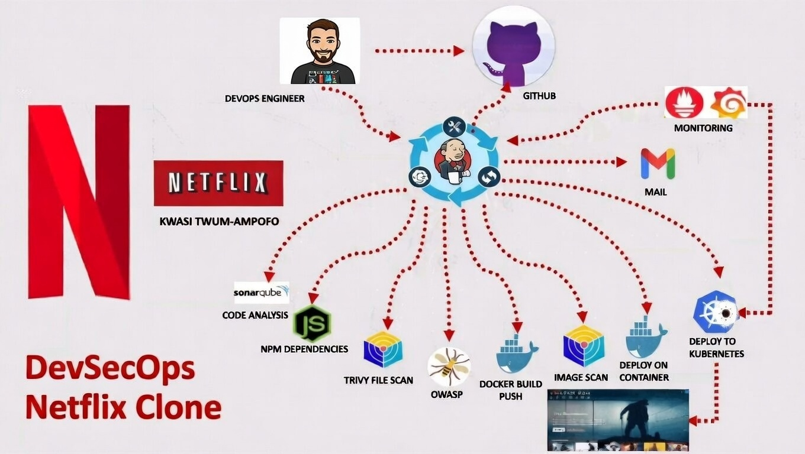

<div align="center"> 
  
# AWS DevSecOps CI/CD Pipeline with EKS, Jenkins & Kubernetes


</div>

---

## 📌 Project Overview

This project demonstrates an **end-to-end DevSecOps CI/CD pipeline** for deploying a containerized **Netflix TMDB-like application** on **AWS EKS**, integrating **security, quality, monitoring, and automation** best practices.

The pipeline provisions infrastructure using **Terraform**, builds and scans Docker images, performs **static code analysis**, deploys to **Kubernetes (EKS)**, and enables **monitoring and alerting** using **Prometheus, Node Exporter, and Grafana**.

---

## 🏗️ Architecture



## **Core Components:**
- AWS EKS (Kubernetes Cluster & Node Groups)
- Terraform (Infrastructure as Code)
- Jenkins (CI/CD Orchestration)
- Docker & Docker Hub
- SonarQube (Code Quality & Security)
- Kubernetes (Deployment & Service)
- Prometheus & Node Exporter (Monitoring)
- Grafana (Visualization)
---

## 📂 Repository Structure

```text
aws-devsecops-ci-cd-pipeline/
|
├───Dockerfile
├───index.html
├───package.json
├───README.md
├───tsconfig.json
├───tsconfig.node.json
├───vercel.json
├───vite.config.ts
├───yarn.lock
├───EKS_TERRAFORM/
├───jenkins-pipeline's/
├───Kubernetes/
├───public
│   └───assets
├───screenshots
└───src
    ├───components
    │   ├───animate/
    │   ├───layouts/
    ├───constant
    ├───hoc
    ├───hooks
    ├───layouts
    ├───lib
    ├───pages
    ├───providers
    ├───routes
    ├───store
    │   └───slices/
    ├───theme
    ├───types
    └───utils
```
# ⚠️ Mandatory Prerequisites (READ CAREFULLY)

Before executing this project, ensure all the following requirements are met.

## ● System Requirements
- **Operating System**: Ubuntu (commands are Ubuntu-specific)
- **Host Machine Size**: Minimum `t2.large` or equivalent (recommended)
- **Resources**: Sufficient disk space & memory for Docker, Jenkins, and SonarQube

## ● AWS & EKS Requirements
- Ensure AWS credentials are configured properly
- Verify Availability Zones before creating the EKS cluster
- Confirm instance type availability in your selected AWS region
- Default VPC & public subnets must exist (used by EKS)

## ● Application Configuration
- Obtain a valid TMDB API Key
- Replace the API key in Jenkins pipeline or environment variables

## 🔹 Docker & Jenkins Credentials

- Add Docker Hub **username & password** in Jenkins Credentials
- Create a `secret.txt` file from your local kubeconfig:
  ```bash
  cat ~/.kube/config > secret.txt
  ```
## 🧩 Required Jenkins Plugins

Ensure the following Jenkins plugins are installed:

- Pipeline  
- Git  
- GitHub Integration  
- Docker Pipeline  
- Kubernetes CLI  
- SonarQube Scanner  
- Email Extension Plugin  
- Credentials Binding  
- Blue Ocean *(optional)*

📌 Configure plugins under:  
`Manage Jenkins → Plugins → Available / Installed`

---

## 🔧 Jenkins Global Configuration

### Tools Configuration
- Configure **JDK**
- Configure **NodeJS**
- Configure **SonarQube Scanner**
- Configure **Docker**

### SonarQube
- Add SonarQube server under:  
  `Manage Jenkins → System → SonarQube Servers`

### Email Notifications
- Configure SMTP email under:  
  `Manage Jenkins → System`
- Enable email alerts for pipeline **failures** & **success**

---

## 📊 Monitoring Setup (Prometheus & Node Exporter)

- Deploy **Node Exporter** on worker nodes  
- Update Prometheus configuration files with correct scrape targets  
- Verify Prometheus UI and metrics collection  
- Import dashboards into Grafana  

📌 Detailed steps are available in the `docs/monitoring.md` file.

---

## 🛠️ Common Issue Fix (IMPORTANT)

**Docker Login / SonarQube Error Fix**

If you face Docker login or SonarQube startup issues:

```bash
systemctl edit docker.service -> Add this in file
[Service]
Environment=DOCKER_MIN_API_VERSION=1.24
```
Then run:
```bash
systemctl daemon-reexec
systemctl restart docker
docker start sonar
```
## 🚀 CI/CD Pipeline Flow

### 🔁 Terraform Pipeline Parameterization

The Terraform EKS pipeline (`terraform-ekscluster.yaml`) is **parameterized** to control the infrastructure lifecycle using a Jenkins input parameter.

#### Supported Actions
- `apply`   → Create or update EKS infrastructure
- `destroy` → Safely tear down all AWS resources

This approach enables:
- Controlled infrastructure provisioning
- Safe cleanup to avoid unnecessary AWS charges
- Reusable pipeline for multiple executions

> ⚠️ Always verify the selected action before triggering the pipeline.

### 📦 Pipeline Execution Stages

1. Terraform provisions or destroys EKS infrastructure
2. Application build & Docker image creation
3. Security scanning & code analysis (SonarQube)
4. Docker image pushed to Docker Hub
5. Kubernetes deployment to EKS
6. Monitoring & alerting enabled
7. Email notifications sent


---

## 🧹 Cleanup (VERY IMPORTANT)

To avoid unnecessary AWS charges:
```bash
terraform destroy  => rerun terraform-ekscluster.yaml and choose [destroy] as action
```
- Delete Jenkins resources if hosted on EC2  
- Remove Docker images if no longer required  
- Clean up Kubernetes resources
---
## 🎯 Key Learnings & Highlights

- End-to-end **DevSecOps automation**  
- **Infrastructure as Code** with Terraform  
- Secure **CI/CD pipeline design**  
- **Kubernetes** production deployment  
- **Monitoring & observability**  
- Real-world **troubleshooting & fixes**
---

## 📝 Notes

- This project uses a **non-modular Terraform structure** for simplicity  
- In production, the Terraform code can be **refactored into reusable modules**  
- All commands are **tested on Ubuntu only**

---

## 👤 Author
**Ghanashyama**  
DevSecOps | Cloud | Kubernetes | CI/CD  
📍 India  

⭐ If you find this project useful, consider **starring the repository!**
